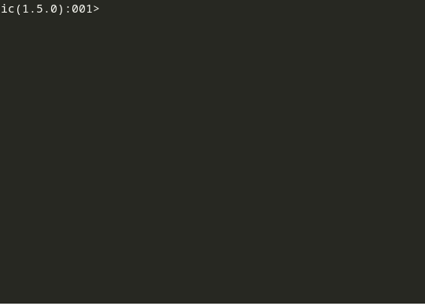

# IC

IC, meaning **Interactive Crystal**, is an interface wrapping the [Crystal Interpreter](https://crystal-lang.org/2021/12/29/crystal-i.html).



## Features:

* [Crystal](https://crystal-lang.org) Interpretation (Indeed!)
* Syntax highlighting
* Multiline input
* Auto formatting
* Auto indentation
* Auto completion (Experimental)
* History
* Pasting of expressions
* Debugger

## Warning:

Crystal-i is experimental and not yet released, the inputted code is not guaranteed to always work as expected. This repository is a preparation for this up-coming feature.

## Installation:

### Dependencies:

You need to install the same dependencies as the crystal compiler, follow the instructions [here](https://github.com/crystal-lang/crystal/wiki/All-required-libraries). If you have already installed crystal from source, you can skip this step.

### Build:

```sh
git clone https://github.com/I3oris/ic.git
cd ic

make
```

### Optimized Build:
```
make release
```
> This is a bit long, and require at least 4.5 GB of available RAM.

## Usage:

### Interactive mode:
```sh
./ic
```

### Run file with arguments:
```sh
./ic say_hello.cr World
```

### Debugger (pry):

On a file use the macro `debugger`:
```cr
# say_hello.cr

debugger # <= will start the debugger at this point
name = ARGV[0]?
puts "Hello #{name}!"
```
Then, run as usually: `./ic say_hello.cr World`.

You will see the current position on your code:
```cr
    1: # say_hello.cr
    2:
    3: debugger # <= will start the debugger at this point
 => 4: name = ARGV[0]?
    5: puts "Hello #{name}!"
    6:
```
On the `pry` prompt you can type:
* `next`    : To jump to the next instruction (without entering into functions).
* `step`    : To jump to the next instruction (entering into functions if possible).
* `finish`  : To jump out of the current function.
* `whereami`: To re-display where the execution is.
* Other     : To interpret code while debugger (e.g the name of a variable).

### Shortcuts:

* `alt-enter`: On multiline input: insert a new line instead of submit edition.
* `ctrl-up`/`down`: On long multiline input: scroll up/down the view.
* `ctrl-a`: Move cursor to begin of the expression.
* `ctrl-e`: Move cursor to end of the expression.
* ... : more up-coming.

only on debugger (pry):
* `ctrl-up`: `whereami`
* `ctrl-down`: `next`
* `ctrl-left`: `finish`
* `ctrl-right`: `step`

### Commands:
You can type the following commands:
* `# clear_history`: Clear history.
* `# reset`: Reset the interpreter (clean all definitions, variables, constants, ...)

## Contributing:

1. Fork it (<https://github.com/I3oris/ic/fork>)
2. Create your feature branch (`git checkout -b my-new-feature`)
3. Commit your changes (`git commit -am 'Add some feature'`)
4. Push to the branch (`git push origin my-new-feature`)
5. Create a new Pull Request

## Contributors:

- [I3oris](https://github.com/I3oris) - creator and maintainer
